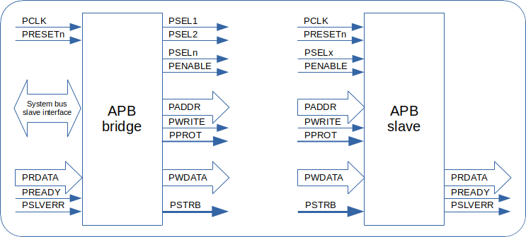
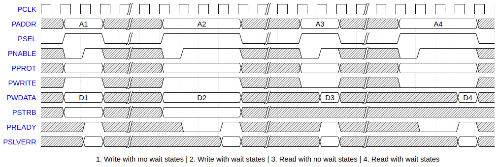

<!-- .slide: data-background="#145A32" -->

## AMBA APB, AHB and AXI

[rodrigomelo9.github.io/digital-design](https://rodrigomelo9.github.io/digital-design/)

Rodrigo Alejandro Melo

[Creative Commons Attribution 4.0 International](https://creativecommons.org/licenses/by/4.0/)

---

### Advanced Microcontroller Bus Architecture

AMBA is a freely available, globally adopted, open standard for the connection and management of functional blocks in a System-on-Chip (SoC).
It facilitates right-first-time development of multiprocessor designs, with large numbers of controllers and peripherals.

----

### AMBA Specs

| AMBA       | AMBA2       | AMBA3           | AMBA4                             | AMBA5
|:---:       |:---:        |:---:            |:---:                              |:---:
|            |             | AXI3 (2003/4)   | AXI4 AXI4-Lite AXI4-Stream (2010) | AXI5 AXI5-Lite AXI5-Stream (2017/21)
|            | AHB (1999)  | AHB-Lite (2006) |                                   | AHB5 AHB5-Lite (2015/21)
| ASB (1996) | ASB (1996)  |                 |                                   |
| APB (1996) | APB2 (1999) | APB3 (2003/4)   | APB4                       (2010) | APB5 (2021)
<!-- .element: style="font-size: 0.5em !important;" -->

> **WARNING:** the first APB and ASB are obsolete (shouldn't be used in new designs)
<!-- .element: style="font-size: 0.4em !important;" -->

Advanced eXtensible Interface                | Advanced High-performance Bus    | Advanced System Bus | Advanced Peripherals Bus
---                                          |---                               |---                  | ---
Full: Higher performance system bus          | AHB: High Performance system bus | System bus          | Low bandwidth peripherals
Lite: Control/Status registers               | AHB-Lite: for single masters     |                     | Control/Status registers
Stream: High speeds unidirectional transfers |                                  |                     |
<!-- .element: style="font-size: 0.35em !important;" -->

----

### Vocabulary

Term        | Description
---         |---
Interface   | APB, AHB, AXI (a core could have multiple)
Channel     | Independent collection of AXI signals associated to a VALID
Bus         | Multi-bit signal (not an interface, not a channel)
Transfer    | (aka beat) single clock cycle, qualified by a VALID/READY handshake
Transaction | Complete communication, with one or more transfers
Burst       | Transaction with more than one transfer
<!-- .element: style="font-size: 0.5em !important;" -->

---

### APB signals

| APB2         | APB3         | APB4 / APB5    | Description
|---           |---           |---             |---
| PCLK         | PCLK         | PCLK           | Clock
| PRESETn      | PRESETn      | PRESETn        | Reset (active low)
| PADDR[A-1:0] | PADDR[A-1:0] | PADDR[A-1:0]   | Address (up to 32 bits)
| PSELx        | PSELx        | PSELx          | Selected
| PENABLE      | PENABLE      | PENABLE        | Enabled
| PWRITE       | PWRITE       | PWRITE         | Write operation
| PWDATA[D-1]  | PWDATA[D-1]  | PWDATA[D-1]    | Write Data. (8, 16 or 32 bits)
| PRDATA[D-1]  | PRDATA[D-1]  | PRDATA[D-1]    | Read Data (8, 16 or 32 bits)
|              | PREADY       | PREADY         | Indicates the completion of a transfer
|              | PSLVERR      | PSLVERR        | Indicates an error condition
|              |              | PPROT[2:0]     | Normal, privileged, or secure protection level
|              |              | PSTRB[D/8-1:0] | Write Strobe (bytes to update during a write)
<!-- .element: style="font-size: 0.4em !important;" -->

----

### APB Signals

----

### APB Signaling

----

### APB5 additional signals

| APB5              | Description
|---                |---
| PWAKEUP           | Wake-up
| PAUSER[up-to-128] | User request attribute
| PWUSER[up-to-D/2] | User write data attribute
| PRUSER[up-to-D/2] | User read data attribute
| PBUSER[up-to-16]  | User response attribute
| P*CHK             | Parity (for safety)
<!-- .element: style="font-size: 0.5em !important;" -->

---

### AHB signals

| AHB2          | AHB-Lite               | AHB5          | Description
|---            |---                     |---            |---
| HCLK          | HCLK                   | HCLK          | Clock
| HRESETn       | HRESETn                | HRESETn       | Reset (active low)
| HADDR[31:0]   | HADDR[31:0]            | HADDR[31:0]   | Address (32-bits, between 10 and 64 in AHB5)
| HSELx         | HSELx                  | HSELx         | Selected
| HTRANS[1:0]   | HTRANS[1:0]            | HTRANS[1:0]   | Transfer type (IDLE, BUSY, NONSEQ, SEQ)
| HWRITE        | HWRITE                 | HWRITE        | Write operation
| HSIZE[2:0]    | HSIZE[2:0]             | HSIZE[2:0]    | Size of the transfer (2^SIZE bytes)
| HBURST[2:0]   | HBURST[2:0]            | HBURST[2:0]   | Burst length and address increments
| HPROT[3:0]    | HPROT[3:0]             | HPROT[2:0]    | Normal, privileged, or secure protection level
| HWDATA[31:0]  | HWDATA[31:0]           | HWDATA[]      | WR (8, 16, 32, 64, 128, 256, 512, 1024 bits)
| HRDATA[31:0]  | HRDATA[31:0]           | HRDATA[]      | RD (8, 16, 32, 64, 128, 256, 512, 1024 bits)
|               | HWSTRB[D/8-1] -- AMBA5 | HWSTRB[D/8-1] | Write Strobe (bytes to update during a write)
| HREADY        | HREADY                 | HREADY        | (IN) other transfers completed
| HRESP[1:0]    | HRESP                  | HRESP         | Transfer response
| HBUSREQx      |                        |               | Bus required
| HLOCKx        |                        |               | Locked access required
| HGRANTx       |                        |               | Locked access has the highest priority
| HMASTER[3:0]  |                        | HMASTER[7:0]  | Manager identifier
| HMASTLOCK     | HMASTLOCK              | HMASTLOCK     | Current transfer is part of a locked sequence
| HSPLITx[15:0] |                        |               | M to re-attempt a split transaction
|               | HREADYOUT              | HREADYOUT     | (OUT) transfer has finished
<!-- .element: style="font-size: 0.35em !important;" -->

----

### AHB5 additional signals

| AHB5              | Description
|---                |---
| HNONSEC           | Indicates Non-secure transaction
| HEXCL             | Exclusive Access
| HEXOKAY           | Exclusive Okay
| HAUSER[up-to-128] | User-defined request attribute
| HWUSER[up-to-D/2] | User-defined write data attribute
| HRUSER[up-to-D/2] | User-defined read data attribute
| HBUSER[up-to-16]  | User-defined response attribute
| H*CHK             | Parity (for safety)
| HCTRLCHK1         | Parity (for safety)
| HCTRLCHK2         | Parity (for safety)
<!-- .element: style="font-size: 0.5em !important;" -->

---

### AXI signals

Write Address Channel    | Write Data Channel         | Read Address Channel     | Read Data Channel
---                      |---                         |---                       |---
AWID[]                   | ~~WID[]~~                  | ARID[]                   | RID[]
AWADDR[]                 | WDATA[]                    | ARADDR[]                 | RDATA[]
AWLEN[7:0] -- __MOD__    | WSTRB[]                    | ARLEN[7:0] -- __MOD__    | RRESP[1:0]
AWSIZE[2:0]              | WLAST                      | ARSIZE[2:0]              | RLAST
AWBURST[1:0]             | WUSER[] -- __NEW__         | ARBURST[1:0]             | RUSER[] -- __NEW__
AWLOCK -- __MOD__        | WVALID                     | ARLOCK -- __MOD__        | RVALID
AWCACHE[3:0]             | WREADY                     | ARCACHE[3:0]             | RREADY
AWPROT[2:0]              | __Write Response Channel__ | ARPROT[2:0]              |
AWQOS[3:0] -- __NEW__    | BID[]                      | ARQOS[3:0] -- __NEW__    |
AWREGION[3:0] -- __NEW__ | BRESP[1:0]                 | ARREGION[3:0] -- __NEW__ |
AWUSER[] -- __NEW__      | BUSER[] -- __NEW__         | ARUSER[] -- __NEW__      | __Global signals__
AWVALID                  | BVALID                     | AWVALID                  | ACLK
AWREADY                  | BREADY                     | AWREADY                  | ARESETn
<!-- .element: style="font-size: 0.5em !important;" -->

> * AXI3: AxLEN[3:0] and AxLOCK[1:0].
> * AXI4: removed WID, added AxQOS, AxREGION and xUSER.
> * AXI5: several signals added (not only parity)
<!-- .element: style="font-size: 0.4em !important;" -->

----

### AXI signals description

Signal   | Description
---      |---
AxPROT   | Protection type (un/privileged, non/secure, data/instruction access)
WSTRB    | Write strobe, indicates valid bytes
xRESP    | OKAY, EXOKAY (exclusive), SLVERR (Slave ERROR), DECERR (Decode ERROR)
AxLEN    | Burst length (AxLEN + 1)
AxSIZE   | 1, 2, 4, 8, 16, 32, 64, 128 bytes of the beat (2^AxSIZE)
AxBURST  | FIXED, INCR, WRAP, reserved
xLAST    | Indicates last beat in the burst
AxLOCK   | Normal, exclusive or locked (only AXI3) access
AxCACHE  | Indicates Bufferable, Cacheable, and Allocate attributes
AxQOS    | Quality of Service
AxREGION | Up to 16 regions for the address decode
xID      | Transaction identifiers (ordering)
xUSER    | User-defined (not recommended)
<!-- .element: style="font-size: 0.5em !important;" -->

---

### AXI-Lite signals

|Write Address Channel | Write Data Channel         | Read Address Channel     | Read Data Channel
|---                   |---                         |---                       |---
|AWADDR[]              | WDATA[]                    | ARADDR[]                 | RDATA[]
|AWPROT[2:0]           | WSTRB[]                    | ARPROT[2:0]              | RRESP[1:0]
|AWVALID               | WVALID                     | AWVALID                  | RVALID
|AWREADY               | WREADY                     | AWREADY                  | RREADY
|                      | __Write Response Channel__ |                          |
|                      | BRESP[1:0]                 |                          | __Global signals__
|                      | BVALID                     |                          | ACLK
|                      | BREADY                     |                          | ARESETn
<!-- .element: style="font-size: 0.5em !important;" -->

> AXI5-lite: several signals added, for parity and more flexibility on bus width and ordering
<!-- .element: style="font-size: 0.4em !important;" -->

---

### AXI-Stream signals

| AXI4-Stream  | AXI5-Stream  | Description
|---           |--            |---
| ACLK         | ACLK         | Clock
| ARESETn      | ARESETn      | Reset (active low)
| TVALID       | TVALID       | Valid
| TREADY       | TREADY       | Ready
| TDATA[D-1:0] | TDATA[D-1:0] | D: 8, 16, 32, 64, 128, 256, 512, 1024 (bits)
| TSTRB[]      | TSTRB[]      | Indicates is the associated byte is a data byte or a position byte
| TKEEP[]      | TKEEP[]      | Indicates which bytes must be transported to the destination
| TLAST        | TLAST        | Indicates the boundary of a packet
| TID[]        | TID[]        | Data stream identifier
| TDEST[]      | TDEST[]      | Provides routing information
| TUSER[]      | TUSER[]      | User-defined sideband information
|              | TWAKEUP      | Wake-up
|              | T*CHK        | Parity (for safety)
<!-- .element: style="font-size: 0.5em !important;" -->

---
<!-- ###################################################################### -->
# Questions?
<!-- .slide: data-background="#1F618D" -->
<!-- ###################################################################### -->

|   |   |
|---|---|
|      | [rodrigomelo9](https://github.com/rodrigomelo9)                          |
|    | [rodrigomelo9ok](https://twitter.com/rodrigomelo9ok)                     |
|  | [rodrigoalejandromelo](https://www.linkedin.com/in/rodrigoalejandromelo) |
|   |   |
