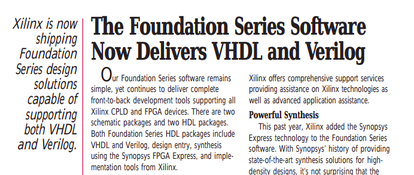
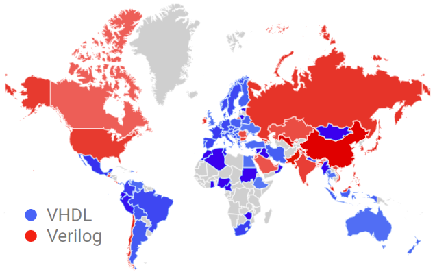
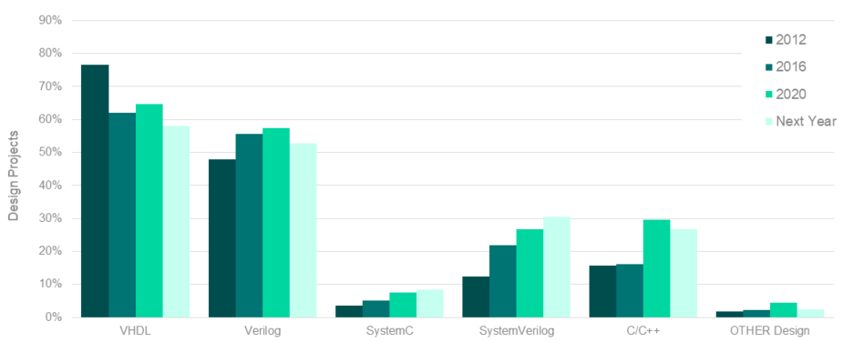
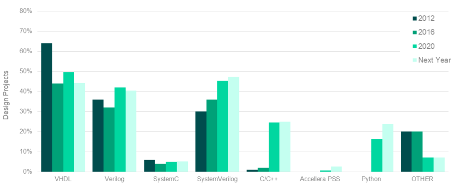
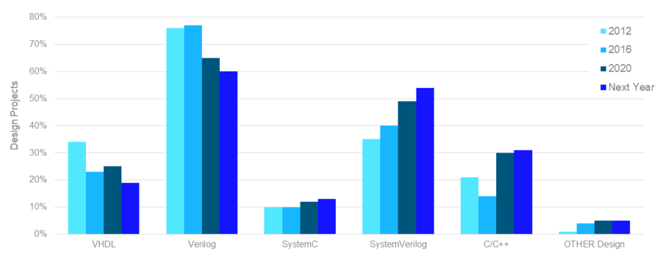
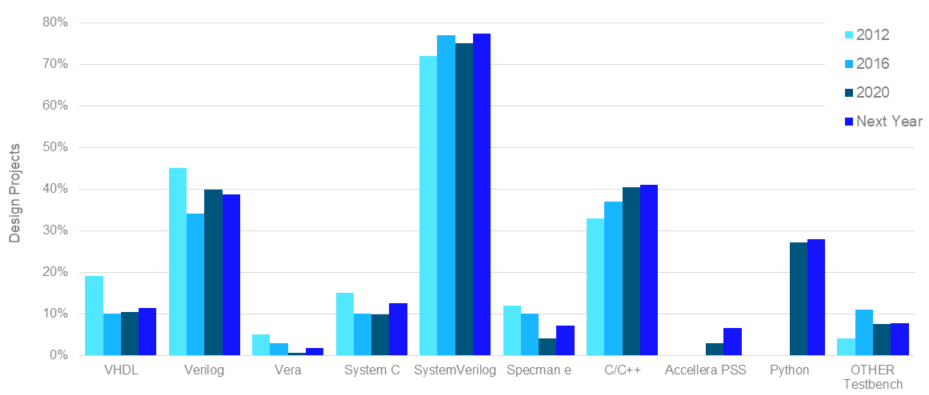

<!-- .slide: data-background="#145A32" -->

# HDL Introduction

[rodrigomelo9.github.io/digital-design](https://rodrigomelo9.github.io/digital-design/)

Rodrigo Alejandro Melo

[Creative Commons Attribution 4.0 International](https://creativecommons.org/licenses/by/4.0/)

---

### Hardware Description Languages

----

#### VHDL

* **V**ery **H**igh **S**peed **I**ntegrated **C**ircuit + **HDL**
* U.S. Department of Defense (1983)
* Standard IEEE 1076 (87, **93**, 00, 02, 08, 19)

----

#### Verilog

* **VERI**fication + **LOG**ic
* Gateway Design Automation (1984), Cadence (1990)
* Standard IEEE 1364 (95, **01**, 05)
* Verilog is now part of System Verilog (IEEE 1800)

----

#### VHDL vs Verilog

* VHDL is strongly typed, CasE InSEnSiTiVe and supports libraries.
* Verilog is weakly typed, case sensitive and doesn’t support libraries.
* You can achieve the same with both of them.
* Verilog is more concise but allows you to write wrong code.

----

#### VHDL'93 - Verilog'01

**Source:** Xcell Journal, issue 27 (1998)

---

### Trends

----

#### Google Trends

**Source:** [VHDL vs Verilog (last 5 years)](https://trends.google.com/trends/explore?date=today%205-y&q=VHDL,Verilog) [Oct 2, 2021]

----

#### FPGA Design Languages

**Source:** [The 2020 Wilson Research Group Functional Verification Study](https://blogs.sw.siemens.com/verificationhorizons/2020/12/16/part-6-the-2020-wilson-research-group-functional-verification-study/) (SIEMENS)

----

#### FPGA Verification Languages

**Source:** [The 2020 Wilson Research Group Functional Verification Study](https://blogs.sw.siemens.com/verificationhorizons/2020/12/16/part-6-the-2020-wilson-research-group-functional-verification-study/) (SIEMENS)

----

#### ASIC Design Languages

**Source:** [The 2020 Wilson Research Group Functional Verification Study](https://blogs.sw.siemens.com/verificationhorizons/2021/01/20/part-10-the-2020-wilson-research-group-functional-verification-study/) (SIEMENS)

----

#### ASIC Verification Languages

**Source:** [The 2020 Wilson Research Group Functional Verification Study](https://blogs.sw.siemens.com/verificationhorizons/2021/01/20/part-10-the-2020-wilson-research-group-functional-verification-study/) (SIEMENS)
