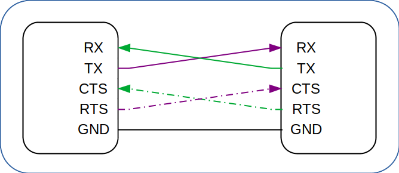

<!-- .slide: data-background="#145A32" -->

## Overview of low-speed serial protocols in a SoC
## UART, I2C, SPI and CAN

[rodrigomelo9.github.io/digital-design](https://rodrigomelo9.github.io/digital-design/)

Rodrigo Alejandro Melo

[Creative Commons Attribution 4.0 International](https://creativecommons.org/licenses/by/4.0/)

---

### UART
#### Universal Asynchronous Receiver/ Transmitter

> The flow control signals RTS (Request to Send) and CTS (Clear to Send) are optional
<!-- .element: style="font-size: 0.4em !important;" -->

----

### Description

----

### Waveforms

---

### I2C
#### Inter-Integrated Circuit

----

### Description

----

### Waveforms

---

### SPI
#### Serial Peripheral Interface

----

### Description

----

### Waveforms

---

### CAN
#### Controller Area Network

----

### Description

----

### Waveforms

---
<!-- ###################################################################### -->
# Questions?
<!-- .slide: data-background="#1F618D" -->
<!-- ###################################################################### -->

|   |   |
|---|---|
|      | [rodrigomelo9](https://github.com/rodrigomelo9)                          |
|    | [rodrigomelo9ok](https://twitter.com/rodrigomelo9ok)                     |
|  | [rodrigoalejandromelo](https://www.linkedin.com/in/rodrigoalejandromelo) |
|   |   |
